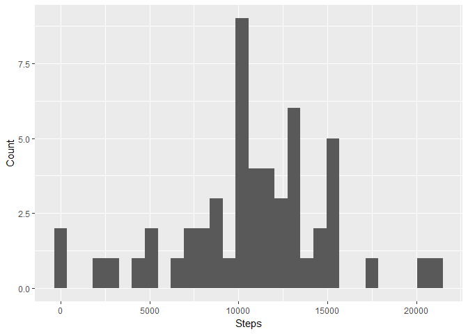
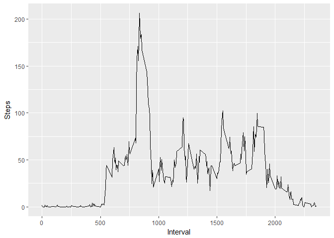
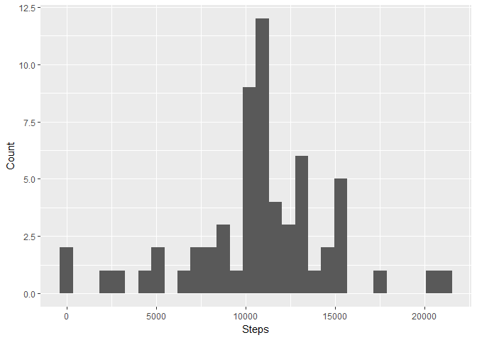
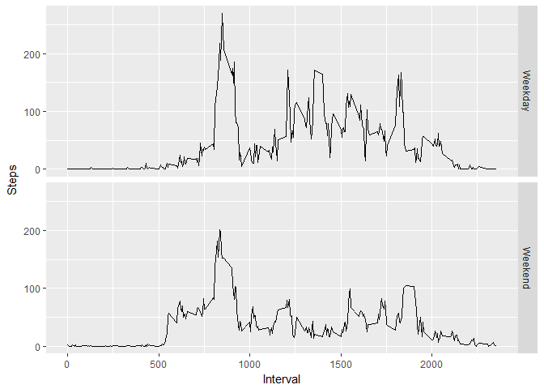

Analysis of Activity Monitoring Data
================
Sawyer Welden
July 28, 2017

Load in the data and required libraries
---------------------------------------

This analysis requires the ggplot2 and lubridate packages

``` r
data <- read.csv("activity.csv")
```

Total Steps per Day
-------------------

Aggregate and plot total steps per day

``` r
steps.by.date <- aggregate(steps ~ date, data = data, FUN = sum)
ggplot(data = steps.by.date, aes(steps)) + 
  geom_histogram(bins = 30) + 
  xlab("Steps") + 
  ylab("Count")
```



Mean and Median steps per day

``` r
mean(steps.by.date$steps)
```

    ## [1] 10766.19

``` r
median(steps.by.date$steps)
```

    ## [1] 10765

Analysing activity intervals
----------------------------

Average steps per 5-minute interval

``` r
steps.by.time <- aggregate(steps ~ interval, data = data, FUN = mean)
ggplot(data = steps.by.time, aes(interval, steps)) + 
  geom_line() + 
  xlab("Interval") + 
  ylab("Steps")
```



Highest Activity Interval

``` r
steps.by.time[which.max(steps.by.time$steps),]$interval
```

    ## [1] 835

The interval with the highest activity was 8:35 - 8:40

Imputing Missing Data
---------------------

First copy the original data set

``` r
data.imputed <- data
```

Then change all Na's to the mean value (excluding Na's)

``` r
mean.steps <- mean(data$steps, na.rm = TRUE)
data.imputed[is.na(data.imputed)] <- mean.steps
```

Histogram of steps per day including imputed values

``` r
imputed.by.date <- aggregate(steps ~ date, data = data.imputed, FUN = sum)
ggplot(data = imputed.by.date, aes(steps)) + 
  geom_histogram(bins = 30) + 
  xlab("Steps") + 
  ylab("Count")
```



Weekdays vs. Weekends
---------------------

Determine which days are weekends and include that in aggregation

``` r
isWeekday <- function(x) {
  day <- wday(x)
  return(day %in% seq(1,5))
}
data$is.weekday <- isWeekday(data$date)
agr <- aggregate(steps ~ interval + is.weekday, data = data, FUN = mean)
agr$is.weekday <- as.factor(agr$is.weekday)
levels(agr$is.weekday) <- c('Weekday','Weekend')
```

Plot activity

``` r
ggplot(data = agr, aes(interval, steps)) + 
  geom_line() + 
  xlab("Interval") + 
  ylab("Steps") + 
  facet_grid(is.weekday ~ .)
```


