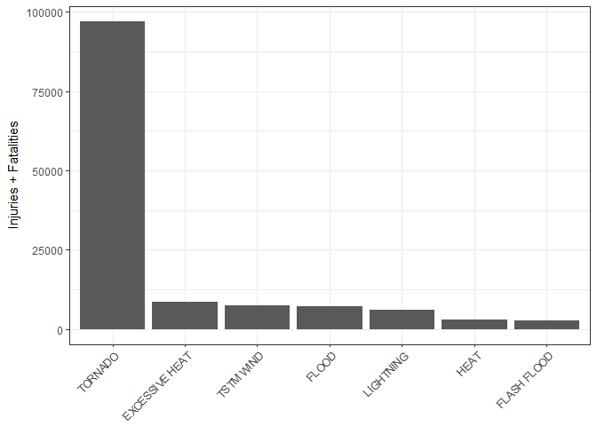
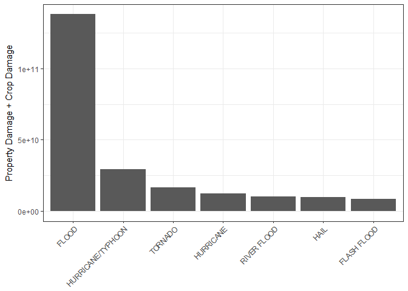

Immediate Effects of Storms on Population Health and Economics, 1950 - 2011
================
Sawyer Welden

Synopsis
--------

The provided data set lists storm events and their health and economic consequences between 1950 and 2011. In the following analysis we tidy up the data and examine the storm event types which contribute most to health and economic damage.

``` r
library(dplyr)
library(ggplot2)
```

Data Processing
---------------

First the data are loaded in from the bz2 compressed csv provided. This operation is large and should be cached.

``` r
stormdata <- read.csv("StormData.csv.bz2")
```

#### Population Health

To see how specific event types affect population health, fatalities, injuries, and their sum should be aggregated against event types:

``` r
fatalities <- aggregate(FATALITIES ~ EVTYPE, data = stormdata, FUN = "sum")
injuries <- aggregate(INJURIES ~ EVTYPE, data = stormdata, FUN = "sum")
combined <- aggregate(INJURIES + FATALITIES ~ EVTYPE, data = stormdata, FUN = "sum")
combined <- cbind(combined, fatalities$FATALITIES, injuries$INJURIES)

colnames(combined) <- c('EVTYPE','SUM','FATALITIES','INJURIES')
combined <- arrange(combined, -SUM)
```

We can now easily see the storm event types with the largest affects on population help:

``` r
head(combined, 10)
```

    ##               EVTYPE   SUM FATALITIES INJURIES
    ## 1            TORNADO 96979       5633    91346
    ## 2     EXCESSIVE HEAT  8428       1903     6525
    ## 3          TSTM WIND  7461        504     6957
    ## 4              FLOOD  7259        470     6789
    ## 5          LIGHTNING  6046        816     5230
    ## 6               HEAT  3037        937     2100
    ## 7        FLASH FLOOD  2755        978     1777
    ## 8          ICE STORM  2064         89     1975
    ## 9  THUNDERSTORM WIND  1621        133     1488
    ## 10      WINTER STORM  1527        206     1321

#### Economic Impact

This data is much more difficult to work with because there is no single variable describing property damage or crop damage, but rather each of those variables has a base value and a multiplier. CROPDMGEXP and PROPDMGEXP modify the value of CROPDMG and PROPDMG respectively. Furthermore, the multipliers are encoded in a strange way. When can see the modifiers with the following code:

``` r
econdata <- stormdata[c('EVTYPE','CROPDMG','CROPDMGEXP','PROPDMG','PROPDMGEXP')]
econdata$CROPDMGEXP <- toupper(econdata$CROPDMGEXP)
econdata$PROPDMGEXP <- toupper(econdata$PROPDMGEXP)

sort(unique(econdata$PROPDMGEXP))
```

    ##  [1] ""  "-" "?" "+" "0" "1" "2" "3" "4" "5" "6" "7" "8" "B" "H" "K" "M"

We can replace these modifiers with their corresponding numeric values and remove incomplete cases. I've queried the first 5 rows of the multipliers to confirm the substitution worked successfully. Note that this code block is computationally expensive and benefits from caching.

``` r
EXPkey <-  c("\"\"" = 10^0,
             "-" = 10^0, 
             "+" = 10^0,
             "0" = 10^0,
             "1" = 10^1,
             "2" = 10^2,
             "3" = 10^3,
             "4" = 10^4,
             "5" = 10^5,
             "6" = 10^6,
             "7" = 10^7,
             "8" = 10^8,
             "9" = 10^9,
             "H" = 10^2,
             "K" = 10^3,
             "M" = 10^6,
             "B" = 10^9)
econdata$CROPDMGEXP <- EXPkey[econdata$CROPDMGEXP]
econdata <- subset(econdata, !is.na(econdata$CROPDMGEXP))

econdata$PROPDMGEXP <- EXPkey[econdata$PROPDMGEXP]
econdata <- subset(econdata, !is.na(econdata$PROPDMGEXP))

head(econdata$CROPDMGEXP,5)
```

    ## [1] 1e+06 1e+03 1e+06 1e+06 1e+06

``` r
head(econdata$PROPDMGEXP,5)
```

    ## [1] 1e+09 1e+06 1e+06 1e+06 1e+06

Note: The code for the formation of EXPkey was found when I was searching for a way to create C-style maps in R. I had a different solution but this one is much more elegant. The differences between OOP and R are one of the most interesting parts of R to me but also the biggest hindrance. We can now multiply each of the numeric values by their multiplier in order to obtain their true values.

``` r
econdata$crop.damage <- econdata$CROPDMG * econdata$CROPDMGEXP
econdata$property.damage <- econdata$PROPDMG * econdata$PROPDMGEXP

crop.sum <- aggregate(crop.damage ~ EVTYPE, data = econdata, FUN = "sum")
property.sum <- aggregate(property.damage ~ EVTYPE, data = econdata, FUN = "sum")
econ.sums <- cbind(crop.sum, property.sum$property.damage)

colnames(econ.sums) <- c("event.type","crop.damage","property.damage")
econ.sums$total.damage <- econ.sums$crop.damage + econ.sums$property.damage
econ.sums <- arrange(econ.sums, -total.damage)

head(econ.sums, 5)
```

    ##          event.type crop.damage property.damage total.damage
    ## 1             FLOOD  5170955450    132836489050 138007444500
    ## 2 HURRICANE/TYPHOON  2607872800     26740295000  29348167800
    ## 3           TORNADO   403379620     16166946743  16570326363
    ## 4         HURRICANE  2688910000      9716358000  12405268000
    ## 5       RIVER FLOOD  5028734000      5079635000  10108369000

Results
-------

#### Population Health

``` r
x <- combined[1:7,]
x$EVTYPE <- factor(x$EVTYPE, levels=x$EVTYPE) # So ggplot doesnt alphabatize x-axis 
ggplot(x, aes(EVTYPE, SUM)) + 
  theme_bw() +
  geom_bar(stat="identity") + 
  xlab(NULL) +
  ylab("Injuries + Fatalities") +
  theme(axis.text.x=element_text(angle = 45, hjust = 1))
```



Tornadoes are responsible for the most personal harm by a wide margin. It's interesting to note that floods and flash floods are classified separately. We can also view the total instances of personal harm from all sources:

``` r
sum(combined$SUM)
```

    ## [1] 155673

#### Economic Impact

``` r
x <- econ.sums[1:7,]
x$event.type <- factor(x$event.type, levels=x$event.type) # So ggplot doesnt alphabatize x-axis 
ggplot(x, aes(event.type, total.damage)) + 
  theme_bw() +
  geom_bar(stat="identity") + 
  xlab(NULL) +
  ylab("Property Damage + Crop Damage") +
  theme(axis.text.x=element_text(angle = 45, hjust = 1))
```



Flooding is responsible for the most economic damage by a wide margin. It's interesting to note that hurricane/typhoon and typhoon are classified separately. We can also view the total economic damage from all sources:

``` r
sum(econ.sums$total.damage)
```

    ## [1] 261503227970
